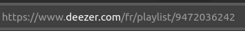

# Deezer to Spotify


## Description

This Python project allows you to transfer playlists from Deezer to Spotify using the APIs of both services. It retrieves tracks from a Deezer playlist, searches for equivalent tracks on Spotify, and creates a new Spotify playlist with those tracks.


## Prerequisites

Before running this project, you need to have the following:

- A Spotify Developer Account to create an app and get credentials.
- A Deezer playlist with an accessible `playlist_id`.
- Python 3.x installed on your machine.


## Installation

1. Install the required Python packages:

```bash
pip install Flask requests spotipy
```

2. Spotify Developer Setup:

    - Go to the [Spotify Developer Dashboard](https://developer.spotify.com/dashboard).
    - Create a new app and get your `Client ID` and `Client Secret`.
    - Set a "Redirect URI" to `http://localhost:8888/callback` in your app settings.

3. Deezer playlist ID:

Here the ID is `9472036242`.


## Run

Run this project by executing this command in the main folder.

```bash
python3 main.py
```


## Usage

Change those variables to yours in 'main.py'.

```python
SPOTIPY_CLIENT_ID = "your_spotify_client_id"
SPOTIPY_CLIENT_SECRET = "your_spotify_client_secret"
SPOTIPY_REDIRECT_URI = "http://localhost:8888/callback"
SCOPE = "playlist-modify-public"

DEEZER_PLAYLIST_ID = "your_deezer_playlist_id"
```


## License

[MIT](https://choosealicense.com/licenses/mit/)